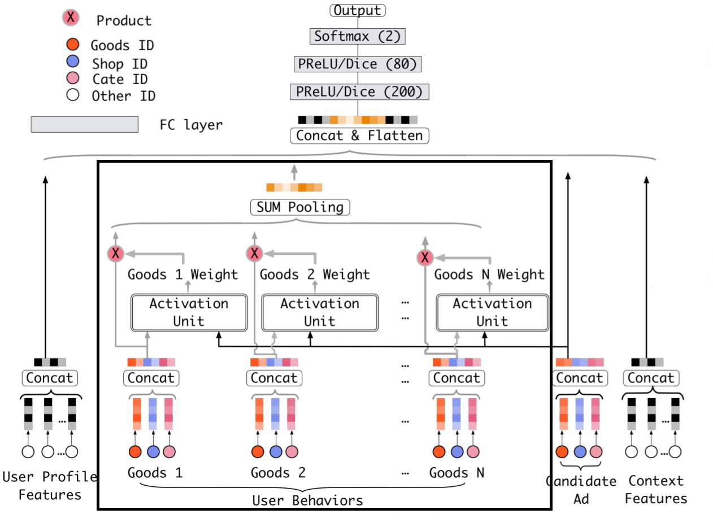

Deep Models
===========

.. contents::
   :local:
   :depth: 1

Overview
--------

Under the success of FM, there are many neural network models based on it, most
of which focus on:

  - adding the capability of modeling high-order feature interactions implicitly or explicitly
  
  - maintaining the ability of modeling low-order feature interactions implicitly or explicitly
  
It is general to apply Deep Neural Network (DNN) whose input should be designed
to capature the high-order feature interactions implicitly and selectively. 

FNN (Factorization-supported Neural Network)
--------------------------------------------

FNN embedding sparse feature into dense latent vector and apply DNN with 
concatenation of latent vectors as input to implicitly and simultaneously 
modeling low-order and high-order feature interactions.

Its network structure is shown below.

.. image:: FNN.png
   :align: center
   :scale: 40 %

You can get the editable figure `here <https://www.processon.com/view/link/5b5824c2e4b0edb750e9e1d5>`_.

[**Springer'2016**]Zhang, Weinan, Tianming Du, and Jun Wang. `Deep learning over multi-field categorical data <https://link.springer.com/chapter/10.1007/978-3-319-30671-1_4>`_, European conference on information retrieval. Springer, Cham, 2016.

PNN (Product-based Neural Network)
----------------------------------

PNN embedding sparse feature into dense latent vector and apply DNN with 
concatenation of latent vectors and inner or outer product of latent vector as 
input to explicitly modeling low-order feature interactions and implicitly 
modeling high-order feature interactions.

Its network structure is shown below.

.. image:: PNN.png
   :align: center
   :scale: 40 %

You can get the editable figure `here <https://www.processon.com/view/link/5b582617e4b053a09c15375d>`_.

[**IEEE'2016**]Qu, Yanru, et al. `Product-based neural networks for user response prediction <https://ieeexplore.ieee.org/abstract/document/7837964/>`_, Data Mining (ICDM), 2016 IEEE 16th International Conference on. IEEE, 2016.

Wide & Deep
-----------

The deep part of Wide & Deep is the same as FNN which embedding sparse feature 
into dense latent vector and apply DNN with concatenation of latent vectors as 
input. While the wide part of Wide & Deep aims to concatenate handcrafted 
feature with deep part's output implicit high-order feature.

Its network structure is shown below.

.. image:: Wide&Deep.png
   :align: center
   :scale: 40 %

You can get the editable figure `here <https://www.processon.com/view/link/5b583084e4b053a09c156380>`_.

[**ACM'2016**]Cheng, Heng-Tze, et al. `Wide & deep learning for recommender systems <https://dl.acm.org/citation.cfm?id=2988454>`_, Proceedings of the 1st Workshop on Deep Learning for Recommender Systems. ACM, 2016.

DeepFM
------

The deep part of DeepFM is the same as FNN which embedding sparse feature 
into dense latent vector and apply DNN with concatenation of latent vectors as 
input. Simultaneously, DeepFM integrates FM with DNN which makes it model the
low-order feature interactions explicitly and high-order feature interactions
implicitly.

Its network structure is shown below.

.. image:: DeepFM_1.png
   :align: center
   :scale: 40 %

You can get the editable figure `here <https://www.processon.com/view/link/59c8dbfce4b0ef561374dea6>`_.

[**arXiv'2017**]Guo, Huifeng, et al. `Deepfm: a factorization-machine based neural network for ctr prediction <https://arxiv.org/abs/1703.04247>`_, *arXiv preprint arXiv:1703.04247* (2017).

NFM (Neural FM)
---------------

NFM embedding sparse feature into dense latent vector and apply DNN with 
element-wise addition of all element-wise product of each two latent vectors as 
input to explicitly modeling low-order feature interactions and implicitly 
modeling high-order feature interactions.

The difference between PNN's inner product layer and NFM is the addition axis
when pooling matrix :math:`V` into DNN's input vector, each of whose column is 
an element-wise product of two latent vectors.

Its network structure is shown below.

.. image:: NFM.png
   :align: center
   :scale: 40 %

You can get the editable figure `here <https://www.processon.com/view/link/5b57f4e4e4b025cf4925e792>`_.

[**ACM'2017**]He, Xiangnan, and Tat-Seng Chua. `Neural factorization machines for sparse predictive analytics <https://dl.acm.org/citation.cfm?id=3080777>`_, Proceedings of the 40th International ACM SIGIR conference on Research and Development in Information Retrieval. ACM, 2017.

AFM (Attentional FM)
--------------------

FM models all factorized feature interactions with the same weight. AFM proposes to differentiate the importance of feature interactions by assigning different weights to feature interaction terms. To do so, AFM first extends FM to the neural netowrk architecture and then introduces the attention mechanism to the sum pooling layer.

.. image:: AFM.png
   :align: center
   :scale: 40 %

The Attention Net is a simple Multi-Layer Perception (MLP) network with an element-wise 
product of two embedding vectors as input and an attention score as output.

Attention formula:

  :math:`a_{ij}' = \mathbf{h}^T * ReLU(\mathbf{W}(\mathbf{v}_i \odot \mathbf{v}_j)x_ix_j + \mathbf{b}) `
  
  :math:`a_{ij} = softmax(a_{ij}')`

Prediction function:

  :math:`y_{AFM} = w_0 + \sum_{i=1}^{n} w_ix_i + \mathbf{p}^T \sum_{i=1}^{n}\sum_{j=i+1}^{n}a_{ij} (\mathbf{v}_i \odot \mathbf{v}_j)x_ix_j `

:math:`y_{AFM}` can exactly recover FM when setting :math:`\mathbf{p}` to :math:`\mathbf{1}` and :math:`a_{ij}` to 1. 

* [**IJCAI'2017**] Jun Xiao, Hao Ye, Xiangnan He, Hanwang Zhang, Fei Wu, Tat-Seng Chua. `Attentional Factorization Machines: Learning the Weight of Feature Interactions via Attention Networks <http://www.ijcai.org/proceedings/2017/0435.pdf>`_, *Proceedings of the Twenty-Sixth International Joint Conference on Artificial Intelligence (IJCAI)*, 2017.

DCN (Deep & Cross Network)
--------------------------

The deep part of DCN is the same as FNN which embedding sparse feature 
into dense latent vector and apply DNN with concatenation of latent vectors as 
input. Simultaneously, DCN applys Cross Net to explicitly model both low-order 
feature interactions and high-order feature interactions. The cross operation
performs with formula:

  :math:`x_{l+1} = x_0 * x_l^T * w_l + b_l + x_l`
  
Additionally, the term :math:`x_0 * x_l^T` in Cross Net explicitly generates 
interactions but different from the term :math:`Σ_iΣ_j<v_i, v_j> * x_i * x_j` in
FM. Specifically, the term :math:`x_0 * (x_l)^T` generates element-level 
interaction while the term :math:`Σ_iΣ_j<v_i, v_j> * x_i * x_j` is vector-level
interaction.

Its network structure is shown below.

.. image:: DCN.png
   :align: center
   :scale: 80 %

[**ADKDD'2017**]Wang, Ruoxi, et al. `Deep & cross network for ad click predictions <https://dl.acm.org/citation.cfm?id=3124754>`_, *Proceedings of the ADKDD'17*. ACM, 2017.

DIN (Deep Interest Network)
---------------------------

DIN is just a simple DNN taking concatenation of latent vectors as input to 
implicitly and simultaneously modeling low-order and high-order feature 
interactions. The success of DIN is that it focus on the problem of embedding
sequence feature — user histories in which there is full of user's interest 
information, and apply attention instead of Long Short Term Memory (LSTM) to 
better utilise user's interest information according to different context.

For example, a woman bought cleanser many times and cloth for relatively less 
time. Then the sequence embedding vector learned with LSTM is unable to provide 
rich information when this woman is currently searching item about cloth.

The architecture of DIN is shown below.

The attention net is a simple Multi-Layer Perception (MLP) shown below, which 
takes concatenation of user's historical good, candidate good and their 
element-wise product as input.

.. image:: DIN_AttentionNet.png
   :align: center
   :scale: 38 %

[**arXiv'2017**]Zhou, Guorui, et al. `Deep interest network for click-through rate prediction <https://arxiv.org/abs/1706.06978>`_, arXiv preprint arXiv:1706.06978 (2017).

xDeepFM (eXtreme DeepFM)
------------------------

As mentioned in DCN, it can expcilitly model both low-order and high-order
element-level feature interactions. Inspired by this, xDeepFM is trying to 
model both low-order and high-order feature interactions under vector-level.

In order to implement such so called Compressed Interaction Network (CIN), it 
concatenates the latent vector into a matrix named feature map instead of a 
vector and performs outer product between two matrixs, which is shown in part 
a of figure below.

Shown in part b of figure below, then using a dense layer **shared** in 
dimention :math:`D` to generate one of :math:`H_k` interaction vectors and 
those :math:`H_k` interaction vectors compose the feature map. All the feature 
maps are finally pooling along dimention :math:`D` into input vectors of output
layer, which is shown in part c.

.. image:: xDeepFM_CIN.png

In addition, integration of Wide & Deep (i.e. LR and DNN) and CIN comes into 
the final xDeepFM shown below.

.. image:: xDeepFM_Arch.png
   :align: center
   :scale: 45 %

[**arXiv'2018**]Lian, Jianxun, et al. `xDeepFM: Combining Explicit and Implicit Feature Interactions for Recommender Systems <https://arxiv.org/abs/1803.05170>`_, arXiv preprint arXiv:1803.05170 (2018).

