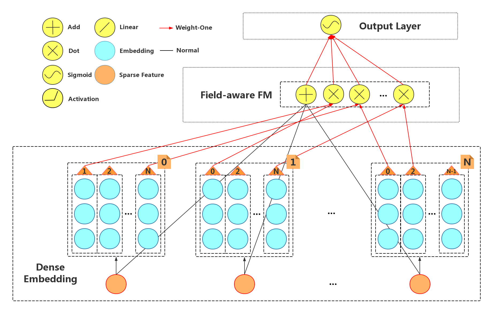

Traditional Models
===================================

FM (Factorization Machines)
-----------------------------

**Model Equation**
  :math:`y(x):= bias + Σ_i(w_i * x_i) + Σ_iΣ_j<v_i, v_j> * x_i * x_j`

FM is based on the idea of embedding which means that it treats each category 
feature as a latent vector and models those iteraction information as inner 
product of latent vectors. Thus FM has some advantages:

- it is able to model reliable interaction information

  For example, the latent vector of :math:`x_k` is invovled in all iteraction 
  terms like (:math:`x_k`, :math:`x_j`), thus the latent vector is estimated 
  well. With these informative latent vector :math:`v_i` and :math:`v_j`, FM 
  then model interaction terms as :math:`<v_i, v_j> * x_i * x_j`.

- it can handle such high sparisty and large scale data

  Though the number of term in FM is quadratic, the same feature :math:`x_i` 
  shares a single latent vector which makes it possible to be optimized into 
  linear complexity. Such optimization is based on the formula:
  
    :math:`2 * Σ_iΣ_j(x_i * x_j) = (Σ_ix_i)^2 - Σ_i(x_i)^2`
  
It can be implemented as neural network shown below.

.. image:: FM.png
   :align: center
   :scale: 40 %

You can get the editable figure `here <https://www.processon.com/view/link/5b5935e8e4b0be50eac1281c>`_.

[**ICDM'2010**]Rendle, Steffen. `Factorization machines <https://ieeexplore.ieee.org/abstract/document/5694074/>`_, *Data Mining (ICDM), 2010 IEEE 10th International Conference on*. IEEE, 2010.

FFM (Field-aware Factorization Machines)
-------------------------------------------

**Model Equation**
  :math:`y(x):= bias + Σ_i(w_i * x_i) + Σ_iΣ_j<V_i[n], V_j[m]> * x_i^{(m)} * x_j^{(n)}`

FFM is based on the FM. FFM embeddings each category feature into multiple 
latent vectors (i.e. a latent vector matrix :math:`V_i`) and models those iteraction 
information between features as inner product of latent vectors from different 
field accordingly. Compared to FM, FFM has some advantages:

- it loses less information in modeling interation terms

  As introduced in FM, the latent vector of :math:`x_k` is shared in all iteraction 
  terms like (:math:`x_k`, :math:`x_j`). Therefore, the latent vector :math:`v_k`
  needs to cooperate with all of other vectors, which constrain :math:`v_k` 
  from better adapting to any :math:`v_j`. 
  
  With such idea, FFM clusters all feature into several fields and shares
  latent vector within each field respectively. All in all, it is a trade-off
  between capacity and reliability.
  
It can be implemented as neural network shown below.

You can get the editable figure `here <https://www.processon.com/view/link/5b59addae4b08d3622916c48>`_.

[**ACM'2016**]Juan, Yuchin, et al. `Field-aware factorization machines for CTR prediction <https://dl.acm.org/citation.cfm?id=2959134>`_, Proceedings of the 10th ACM Conference on Recommender Systems. ACM, 2016.   

GBDT+LR
----------

As mentioned in Introduction, the brute force approach modeling interaction
information is taking all interaction terms into consideration. Such brute way
is also applicable to high order interaction, thus supposing we just consider
the situaction no more than two order. 

Obviously, not all interaction terms are useful and it is critical to find out
those useful ones. Inspired by this, this hybrid model uses Gradient Boosting 
Decision Tree (GBDT) to get high order interaction feature. 

Concretely, the output of each individual tree is used to generate one
categorical feature with index of the leaf that instance falls in as value.
For example, consider the boosted tree model in figure shown below, which has
2 subtrees with 3 leafs and 2 leafs respectively. If an instance ends up in
leaf 2 and leaf 1 respectively, then the high order interaction feature vector
are [2,1] whose one-hot encoding vector is [0,1,0,1,0].

The hybrid model structure — concatenation of GBDT and LR is shown below.

.. image:: GBDT+LR.png
   :align: center
   :scale: 50 %
   

[**ACM'2014**]He, Xinran, et al. `Practical lessons from predicting clicks on ads at facebook <https://dl.acm.org/citation.cfm?id=2648589>`_, Proceedings of the Eighth International Workshop on Data Mining for Online Advertising. ACM, 2014.

