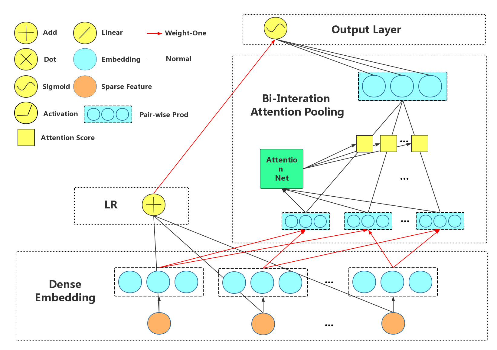

AFM (Attentional FM)
===================================

NFM embedding sparse feature into dense latent vector and apply DNN with 
element-wise addition of all element-wise product of each two latent vectors 
with weight computed by Attention Net as input to explicitly modeling low-order 
feature interactions and implicitly modeling high-order feature interactions.

The Attention Net is a simple Multi-Layer Perception (MLP) with an element-wise 
product of two latent vectors as input and an attention score as output. There
is its formula:

  :math:`tmpA_{ij} = h^T * ReLU(W * Prod_(element-wise)(v_i, v_j) * x_i * x_j + b)`
  
  :math:`{A_{ij}} = softmax({tmpA_{ij}})`

Its network structure is shown below.

   
You can get the editable figure `here <https://www.processon.com/view/link/5b581b40e4b067df59ea0ac3>`_.

[**IJCAI'2017**]Xiao, Jun, et al. `Attentional factorization machines: Learning the weight of feature interactions via attention networks <http://www.ijcai.org/proceedings/2017/0435.pdf>`_, Proceedings of the Twenty-Sixth International Joint Conference on Artificial Intelligence. IJCAI, 2017.

