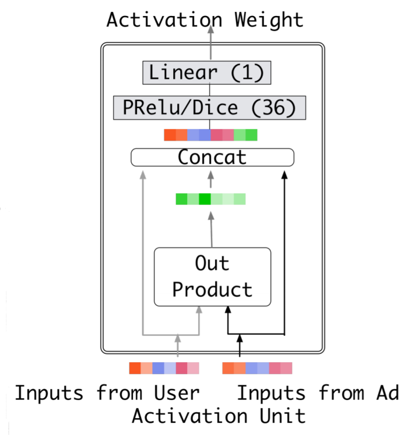

DIN (Deep Interest Network)
===================================

DIN is just a simple DNN taking concatenation of latent vectors as input to 
implicitly and simultaneously modeling low-order and high-order feature 
interactions. The success of DIN is that it focus on the problem of embedding
sequence feature — user histories in which there is full of user's interest 
information, and apply attention instead of Long Short Term Memory (LSTM) to 
better utilise user's interest information according to different context.

For example, a woman bought cleanser many times and cloth for relatively less 
time. Then the sequence embedding vector learned with LSTM is unable to provide 
rich information when this woman is currently searching item about cloth.

The architecture of DIN is shown below.

.. image:: DIN_Arch.png

The attention net is a simple Multi-Layer Perception (MLP) shown below, which 
takes concatenation of user's historical good, candidate good and their 
element-wise product as input.

[**arXiv'2017**]Zhou, Guorui, et al. `Deep interest network for click-through rate prediction <https://arxiv.org/abs/1706.06978>`_, arXiv preprint arXiv:1706.06978 (2017).

