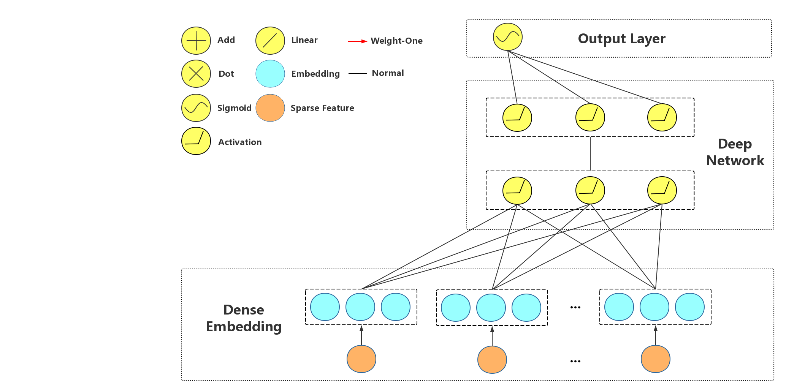

FNN (Factorization-supported Neural Network)
=============================================

[**Springer'2016**]Zhang, Weinan, Tianming Du, and Jun Wang. `Deep learning over multi-field categorical data <https://link.springer.com/chapter/10.1007/978-3-319-30671-1_4>`_, European conference on information retrieval. Springer, Cham, 2016.