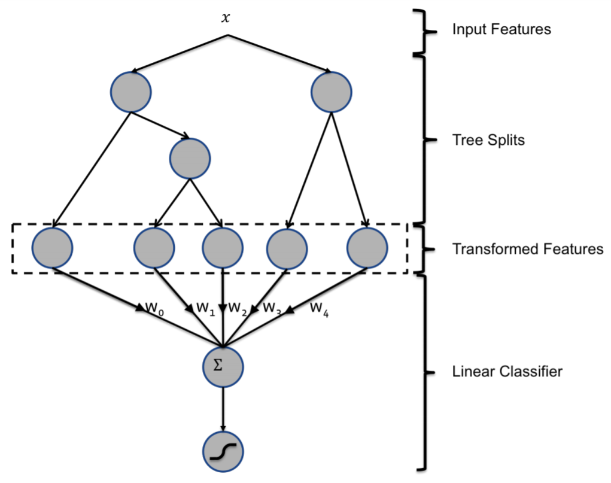

GBDT+LR
===========

As mentioned in Introduction, the brute force approach modeling interaction
information is taking all interaction terms into consideration. Such brute way
is also applicable to high order interaction, thus supposing we just consider
the situaction no more than two order. 

Obviously, not all interaction terms are useful and it is critical to find out
those useful ones. Inspired by this, this hybrid model uses Gradient Boosting 
Decision Tree (GBDT) to get high order interaction feature. 

Concretely, the output of each individual tree is used to generate one
categorical feature with index of the leaf that instance falls in as value.

The hybrid model structure — concatenation of GBDT and LR is shown below.

   

[**ACM'2014**]He, Xinran, et al. `Practical lessons from predicting clicks on ads at facebook <https://dl.acm.org/citation.cfm?id=2648589>`_, Proceedings of the Eighth International Workshop on Data Mining for Online Advertising. ACM, 2014.
