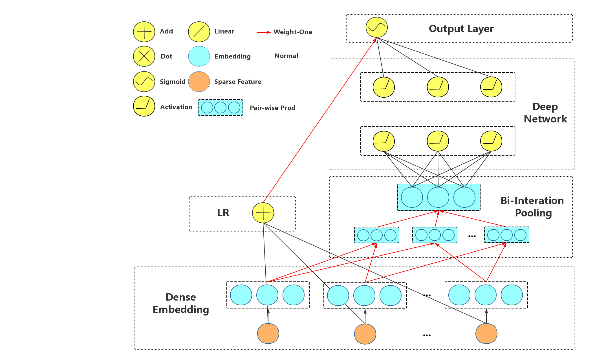

NFM (Neural FM)
===================================

NFM embedding sparse feature into dense latent vector and apply DNN with 
element-wise addition of all element-wise product of each two latent vectors as 
input to explicitly modeling low-order feature interactions and implicitly 
modeling high-order feature interactions.

The difference between PNN's inner product layer and NFM is the addition axis
when pooling matrix V into DNN's input vector, each of whose column is a 
element-wise product of two latent vectors.

Its network structure is shown below.

You can get the editable figure `here <https://www.processon.com/view/link/5b57f4e4e4b025cf4925e792>`_.

[**ACM'2017**]He, Xiangnan, and Tat-Seng Chua. `Neural factorization machines for sparse predictive analytics <https://dl.acm.org/citation.cfm?id=3080777>`_, Proceedings of the 40th International ACM SIGIR conference on Research and Development in Information Retrieval. ACM, 2017.