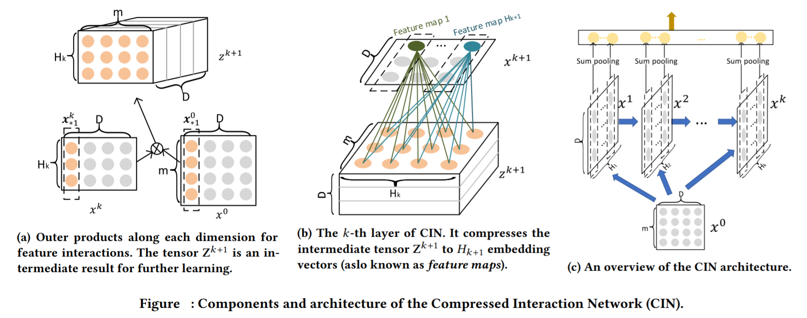
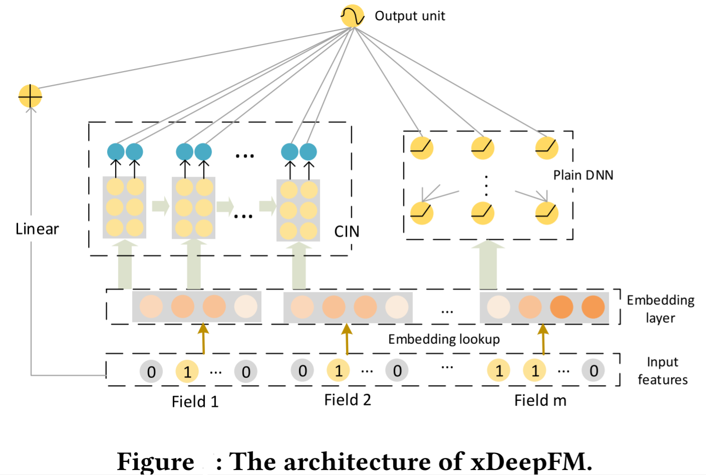

xDeepFM (eXtreme DeepFM)
===================================

As mentioned in DCN, it can expcilitly model both low-order and high-order
element-level feature interactions. Inspired by this, xDeepFM is trying to 
model both low-order and high-order feature interactions under vector-level.

In order to implement such so called Compressed Interaction Network (CIN), it 
concatenates the latent vector into a matrix named feature map instead of a 
vector and performs outer product between two matrixs, which is shown in part 
a of figure below.

Shown in part b of figure below, then using a dense layer **shared** in 
dimention D to generate one of H_k interaction vectors and those H_k 
interaction vectors compose the feature map. All the feature maps are finally 
pooling along dimention D into input vectors of output layer, which is shown in
part c.

:math:`x_i`

In addition, integration of Wide & Deep (i.e. LR and DNN) and CIN comes into 
the final xDeepFM shown below.

[**arXiv'2018**]Lian, Jianxun, et al. `xDeepFM: Combining Explicit and Implicit Feature Interactions for Recommender Systems <https://arxiv.org/abs/1803.05170>`_, arXiv preprint arXiv:1803.05170 (2018).

